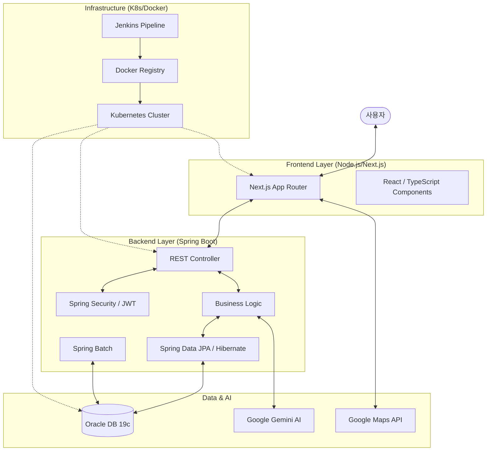

# 🌍 TravelVibe - AI 맞춤형 여행 일정 플래너

AI 기술을 활용하여 사용자에게 최적의 여행 일정을 제안하고 관리해 주는 지능형 여행 플래너 서비스입니다.  
사용자의 취향(대륙, 국가, 도시, 기간, 인원, 스타일, 템포 등)을 분석하여 Google Gemini AI를 통해 세상에 하나뿐인 일정을 생성합니다.

---

## 🛠️ 기술 스택 (Tech Stack)

### Infrastructure & CI/CD


### Frontend


### Backend


### Database & AI


---

## 📐 아키텍처 다이어그램 (Architecture Diagram)



---

## ✨ 핵심 기능 (Key Features)

- 🤖 **AI 맞춤 일정 생성**: 대륙, 국가, 도시 선택부터 여행 스타일, 동행자, 템포까지 고려한 AI(Gemini) 기반 일정 생성.
- 📍 **인터랙티브 지도**: 생성된 각 장소를 Google Maps와 연동하여 위치를 시각화하고 이동 경로(거리)를 표시.
- 🗓️ **일정 관리**: 나만의 여행 계획을 저장하고, 마이페이지에서 언제든지 확인 및 관리 기능 제공.
- 🔐 **보안 및 인증**: JWT 기반의 Spring Security를 통해 안전한 회원 관리 및 데이터 보호.
- ⚙️ **CI/CD 자동화**: Jenkins 파이프라인을 통해 Docker 빌드 및 Kubernetes 배포 자동화.

---

## 📁 프로젝트 구조 (Project Structure)

```text
myFirstAntigravityProject/
├── myapp/
│   ├── node-app/           # Next.js 프론트엔드
│   ├── spring-boot/        # 메인 백엔드 API 서버
│   ├── spring-batch-app/   # 배치 처리 어플리케이션
│   ├── jenkins/            # Jenkins 설정 및 Dockerfile
│   ├── k8s/                # Kubernetes Deployment/Service YAML
│   └── docker-compose.ci.yml
├── restart.sh              # 자동 기동 스크립트
├── portforward.sh          # 로컬 포트포워딩 스크립트
└── README.md
```

---

## 🚀 시작하기 (Getting Started)

### 사전 요구 사항
- Docker Desktop
- Minikube
- Node.js (v18+)
- Java (v15+)

### 실행 방법
1. **서버 총괄 기동**
   ```bash
   cd ~/myapp && bash restart.sh
   ```
2. **포트 포워딩 설정 (필수)**
   ```bash
   # 터미널 A (프론트엔드)
   kubectl port-forward svc/node-app-service 3000:3000 --address 0.0.0.0
   
   # 터미널 B (백엔드)
   kubectl port-forward svc/spring-boot-service 8080:8080 --address 0.0.0.0
   ```
3. **접속 주소**
   - 프론트엔드: `http://localhost:3000`
   - 백엔드 API: `http://localhost:8080`
   - Jenkins: `http://localhost:8090`

---

## 🤝 CI/CD 파이프라인
프로젝트는 **Jenkins Pipeline (Groovy)**를 사용하여 지속적 통합 및 배포를 수행합니다.
1. Git Commit & Push
2. Jenkins Webhook 트리거
3. Docker Image 빌드 및 Push (Local Registry)
4. Minikube Kubernetes 리소스 업데이트 및 Rolling Update 수행

---

## 🛡️ 라이선스
- 이 프로젝트는 학습 프로젝트의 일환으로 제작되었습니다.
